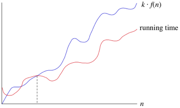

# Chapter 3: Algorithms
## Math 275 | Summer 2021
---

## Algorithms
* An algorithm are precise step by step instructions for completing a task.
* Pseudocode is useful for understanding algorithms.
  * Syntax is self-explanatory

### Bubble Sort
* Simple sorting algorithm
* Not that efficient
* Works by iterating through array, and comparing element with the next element, and then switching them if they are not in order.
* In practice, this consists of two nested for loops. The outer for loop iterates through the *length of the array* (you don't actually use its index to swap) to guarantee all elements are swapped, and the inner loop loops from the beginning of the array to the last sorted value and does the actual sorting.
* The inner loop does the actual swapping, you have the outer loop there to make sure the inner loop swaps everything the necessary amount of times. If you didn't have the outer loop, and you looped only once, you'd only guarantee the max element be sorted.
* With each pass of outer for loop, an element is guaranteed to be sorted.
  * Let's say, we are trying to sort the following array: `[2, 3, 4, 1, 5]`.
  * The first outer for loop pass guarantees that the largest element, `5`, is in the correct position.
  * The second outer for loop pass guarantees that the two largest elements, `4`, `5`, are in their correct positions.
  * The third outer for loop guarantees that the three largest elements, `3`, `4`, and `5`, are in their correct positions.
  * >The fourth pass consists of one comparison, namely, the comparison of `1` and `2`. Because `1` < `2`, these elements are in the correct order. This completes the bubble sort.
* This is why the outer loop exists: to guarantee more and more numbers being sorted. Thus you iterate over the length of the array, so you can make sure that length is sorted.
* Because with each pass, we have more and more numbers that are sorted, the inner loop doesn't need to iterate over those sorted values. Thus it just needs to iterate through the beginning to the last unsorted value.
* You can think of each pass of the inner loop, as going over a new smaller array (new and smaller because it's not going over the last element), and pushing that max value to the end. Once it pushes that max value end, it goes over the array again (but without what it just pushed to the end, so it's like it's iterating over a newer smaller array), and then pushes the new max to the end. It then does this again and again until the array's size becomes 0.

Example implementation assuming, `swap()` function is defined and implemented:

~~~C++
void bubbleSort(int arr[], int n) {
    int i, j;
    for (i = 0; i < n - 1; i++) { // it's n - 1, because index starts at 0, so its size - 1
        // Last i elements are already in place, so need to iterate over them
        for (j = 0; j < n - i - 1; j++) {
            if (arr[j] > arr[j + 1]) {
                swap(&arr[j], &arr[j + 1]);
            }
        }
    }
}
~~~

### Insertion Sort

* Simple sorting algorithm, but not efficient.
* Starts at second element, and compares it with first element.
* If second is less than first, inserts it behind first, and first is now second, and second is now first.

From GeekSort:
To sort an array of size n in ascending order: 
1. Iterate from arr[1] (second element) to arr[n] (last element) over the array. 
2. Compare the current element (key) to its predecessor. 
3. If the key element is smaller than its predecessor, compare it to the elements before. Move the greater elements one position up to make space for the swapped element.

* The "compare to the elements before" in the third step is done by a while loop. So this algorithm uses a for loop and a while loop. The for loop iterates *only once*, and stops when it hits that `n + 1` is > `n`. Then the while loop kicks in.
* The while loop then basically swaps the misplaced element with the one behind it, and does that swap again and again, until the misplaced element is in the correct place.
  * When it does that swap, all the elements bigger than it, move up one place, which sorts them in the correct place.

~~~C++
void insertionSort(int arr[], int n) {
    int i, key, j;
    for (i = 1; i < n; i++) {
        key = arr[i];
        j = i - 1;

        /* Move elements of arr[0..i-1], that are greater than key, to one position ahead
        of their current position */
        while (j >= 0 && arr[j] > key) {
            arr[j + 1] = arr[j];
            j = j - 1;
        }
        arr[j + 1] = key;
    }
}
~~~

## Growth of Functions
### Big-O
* We use Big-O notation to track the growth of functions without having to worry about constant multipliers or smaller order terms.
* Formally, we say that a function $f(x)$ is $O(g(x))$, when: $|f(x)| ≤ C|g(x)|, \text{whenever } x > k$,
* Basically this means a function is big-O of another function g(x), *if* g(x) is greater or equal than it, while multiplied by some constant C, after some point k.
* All this means, is that the O(x) functions acts as an upper bound for f(x). f(x) must be smaller than O(g(x)) for it to be true.

We can visualize Big-O like this: 

The blue represents g(x) and the red represents f(x). After some point (marked by the dashed line), g(x) is ALWAYS bigger than f(x). Thus we can say that f(x) is O(g(x)).

#### Example
Show that $f(x)=x^2 +2x+1$ is $O(x^2)$.

Already, we can guess that f(x) is $O(x^2)$, as they're both the same degree. Using our formal definition of Big-O, we can also further intuitively know that it is $O(x^2)$, because if we were to multiply $x^2$ by 100, or any other really large number, it would act as C, and we can obviously know it would act as a bigger upper bound than f(x).

However, we can approach the example more systematically as well, but the systematic approach uses the same logic as the intuitive approach. For f(x) to be $O(x^2)$, each term must be less than or equal to $x^2$, at some point $x$. For the sake of easiness, let's look at when $x > 1$. The first term, $x^2$ is obviously less than or equal to $x^2$, regardless of what x equals to. The second term is $2x$. If we look at the $2x$ term, the $2x$ is greater than $x^2$ when x is between 1 and 2. But, since we're also allowed to use multiples of $x^2$, as is stated in the formal definition of big-O, we can look at $2x^2$, and see that $2x^2$ is greater than $2x$ when x > 1. So now we have $2x^2 > 2x$. Note we could have used any multiple of $x^2$, so long as it made it bigger when x > 1. The final term is 1, and $x^2$ is greater than 1 when x > 1. Now we can construct this inequality, substituting our new larger terms in: $x^2 +2x+1 ≤ x^2 +2x^2 + x^2 = 3x^2$. Since we showed each of the terms were larger than some other value, we can substitute those larger values in to make the inequality. And since $f(x) ≤ 3x^2$, which is a multiple of $x^2$, we can say that $f(x)$ is $O(x^2)$, when x > 1. We can pick other x values as well to prove that it is $O(x^2)$, but, regardless, we just need to state which x-value we used.

***NOTE***

**This is a very important caveat.** Just because $f(x)$ is $O(x^2)$ does not mean, it is not big-O of any other function. Remember O(x) is an upper bound on f(x). f(x) is big-O of a myriad of other functions, not just multiples of quadratics. f(x) is also big-O of $x^3$ and many exponential and power functions. As long as it isn greater tha f(x), f(x) is big-O of that function.

### Big-Omega

### Big-Theta

### Important Fucntions
### Combinations of Functions

